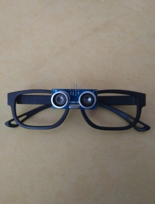
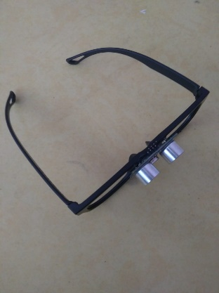
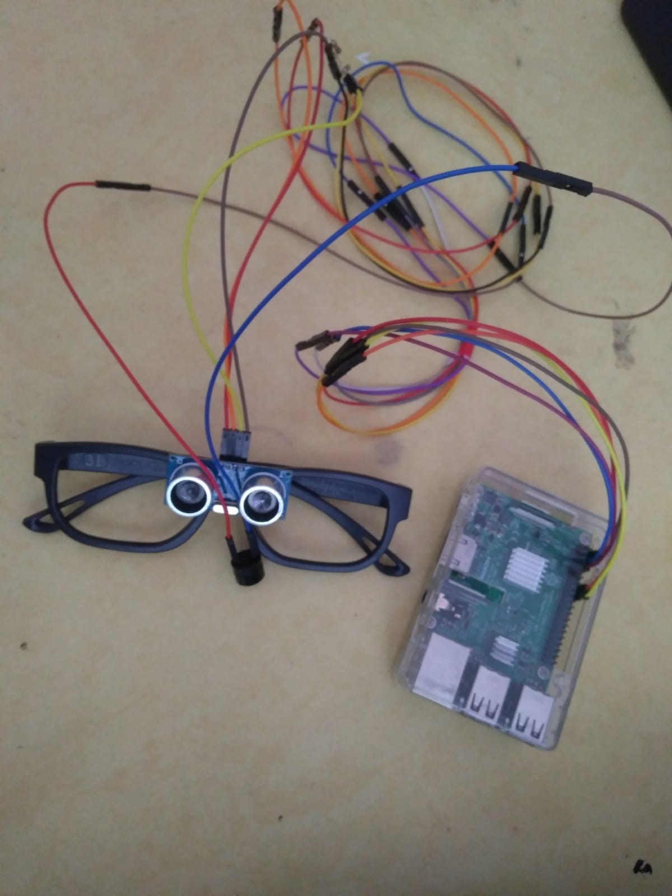
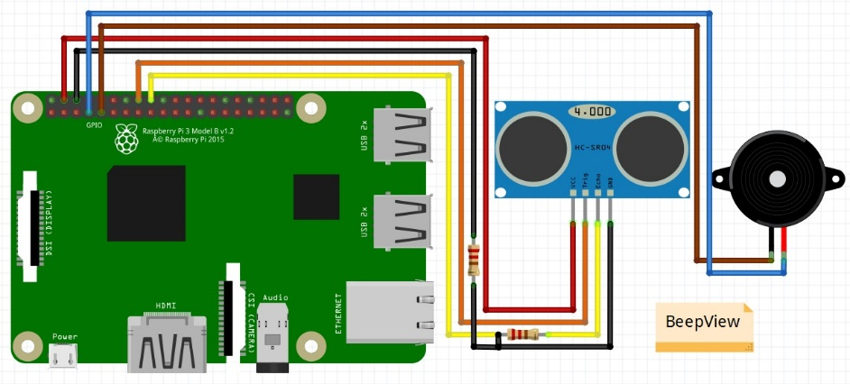
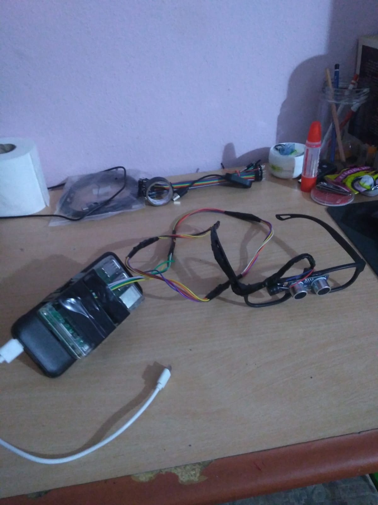

# beepView

**1.Giriş**

Bu proje çalışmasında Raspberry Pi 3B ve diğer gerekli malzemeler
kullanılarak görme engelli bireyler için yardımcı bir gözlük
tasarlanması amaçlandı.

**2.Amaç**

Görme engelli bireylerin etrafındaki nesneleri gözlük üzerine bağlanmış
sensörler aracılığıyla uzaklıklarının ölçülerek bu alınan verinin sesli
uyarı yardımıyla kişinin gözlük doğrultusundaki nesneden uzaklığı
hakkında bir fikir edinmesini sağlayarak, oluşabilecek kazalar konusunda
hedef bireylere yardımcı olmaktır.

**3.Kullanılan Donanımlar**

-   **3.1. Raspberry Pi 3B:**

    -   Raspberry Pi, İngilterde bulunan Raspberry Pi Vakfı tarafından
        desteklenen; öğrenci, amatör ve hobicilerin kullanımına sunulan
        kredi kartı büyüklüğünde, tek bir board\'dan oluşan mini
        bilgisayardır.

    -   Projemizde veri işlemek ve gerekli girdi ve çıktıları control
        etmek için kullanacağız.

-   **3.2. Hc-Sr04 Ultrasonik Mesafe Sensörü:**

    -   Hc-sr04 ultrasonik sensör sonar(Sound Navigation and Ranging )
        kullanarak karşısındaki nesneye olan mesafesini hesaplayan bir
        input kaynağıdır.Sonar dediğimiz sistem ses dalgalarını
        kullanarak cismin uzaklığını boyutunu elde etmemizi sağlar.

    -   Projemizde uzaklık verisini almak için kullanacağız.

-   **3.3. PowerBank:**

    -   Powerbank kısaca taşınabilir şarj cihazıdır.

    -   Projemizde Raspberry'nin ihtiyacı olan gücü üretmesi, vücut
        üzerinde taşınabilir olması ve mobil bi halde ürünün kullanımını
        yapabilmemiz için kullanacağız.

-   **3.4. Buzzer:**

    -   Buzzer dediğimiz devre elemanını ufak bir hoparlör olarak
        düşünebiliriz. Hoparlörler kadar yüksek ve detaylı ses
        üremeseler de, "bip" leme seslerini çıkartmada oldukça
        başarılıdırlar. Bu tarz buzzer fiyatları çok uygundur.[\
        

    -   Projemizde çıktı birimi olarak kullanacağız .

**4.Kullanılan Diğer Malzemeler**

-   Gözlük

-   Jumper Kablolar

-   10K Direnç

**5.Çalışma Prensibi**

Projemizin çalışma prensibi, Raspberry kartımız sensörden gelen
nesnelere olan uzaklık verisini alır, bu veriyi anlayacağımız santimetre
cinsine çevirerek eğer nesnenin kullanıcıya olan yakınlığı 120 cm'in
altına düşerse buzzer aracılığıyla bip sesi ile kullanıcıyı önünde bir
cisim olduğu konusunda uyarır. Bip seslerinin uyarısı cismin uzaklığına
göre hızlanır ya da yavaşlar.

Projemizde kullanılan kod Python programa dili kullanılarak yazıldı. İlk
olarak projemize gerekli kütüphaneler eklenip kullandığımız GPİO
pinlerinin tanımlaması yapıldı. Sonrasında, gerektiğinde
çağırabileceğimiz buzzer isimli fonksiyon yaratarak, çağrıldığında
tanımladığımız "delay" değişkeni kadar aralıklarla buzzer'ımıza yüksek
voltaj göndererek bip sesi çıkarmasını sağlıyor. Bir sonraki adımda ise
sensörden gelen uzaklık verisini sürekli olarak hesaplatıp, bu veri
doğrultusunda "eğer" fonksiyonunu kullanarak buzzer'ın beep sesleri
arasında ne kadar bekleyeceğini değiştiriyoruz.

**6.Sonuç**

Sonuç olarak, sensörden gelen uzaklık verisi alınıp raspberry
aracılığıyla işlenip bip sesi olarak çıktı alınarak görme engelli
kullanıcıların sensör doğrultusunda bir nesne olup olmadığını ve
uzaklığı hakkında fikir edinmesini sağlayan ürünümüzü hazırladık. Bu
ürünün bir yardımcı ürün olduğunun bilinerek kullanılması gerekmekte
çünkü sensörünün tek doğrultuda uzaklık alması sonucu etraftaki çoğu
nesne cihazın tespit edebileceği alan dışında kalabilir, Raspberry Zero
veya Arduino Micro gibi kartlar kullanılarak güç tüketimi ve mobilite
arttırılabilir, farklı sensörlerle veya birden fazla açıda sensor
kullanılarak projenin algılayabildiği alan arttırılarak bu proje
geliştirilebilir.
